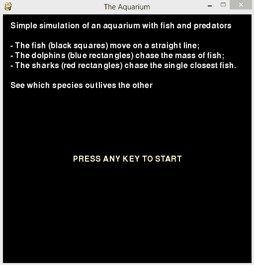

### Aquarium
Simple simulation of an aquarium with fish and predators

- The fish (black squares) move on a straight line;
- The dolphins (blue rectangles) chase the mass of fish;
- The sharks (red rectangles) chase the single closest fish.

See which species outlives the other

This code was written as an exercise to familiarise myself with PyGame

> **Requirements**:  
You need Pygame. I used version 1.9.2a0.  
Link: http://www.pygame.org/download.shtml
